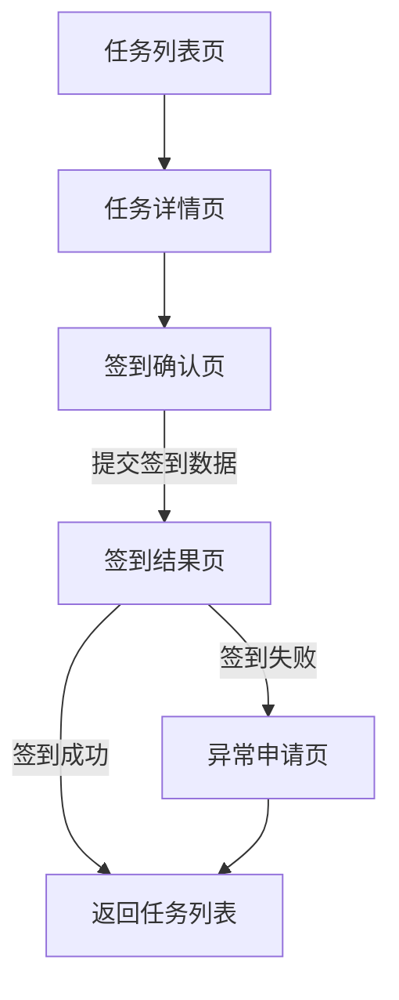
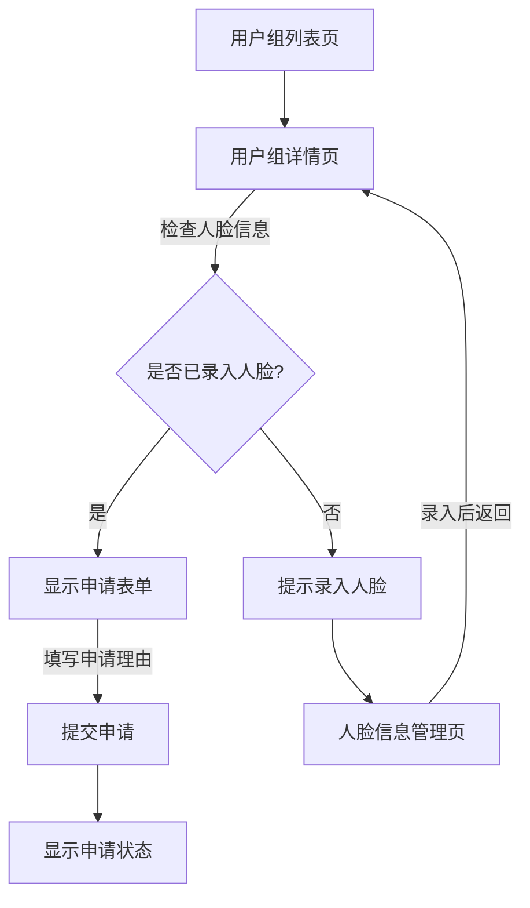
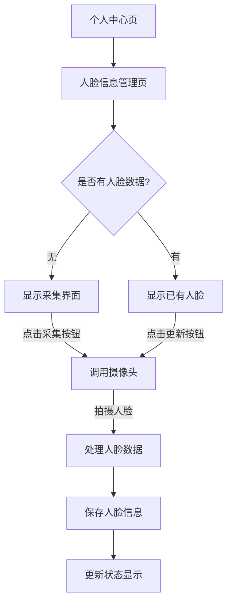
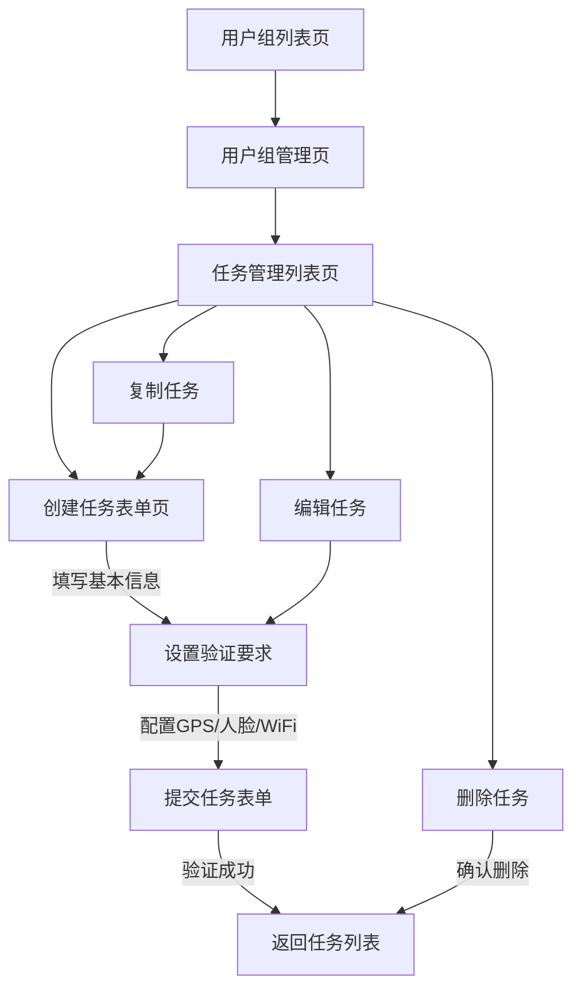

# 6. 表示层解决方案

## 6.1 表示层概述

表示层分为 Web 管理端和移动应用端，共同服务于签到业务流程。Web 端主要提供管理功能，包括用户和组织管理、任务创建与监控、签到数据统计分析和异常情况审核等；移动端则侧重实际签到操作，支持地理位置校验、人脸识别和无线网络检测，并提供异常申请与个人记录查询功能。两端共享核心业务模型和数据结构，通过分层设计保证界面交互流畅、状态管理清晰和数据操作一致，形成完整的签到管理与执行闭环。

## 6.2 用例实现

### 6.2.1 移动端用例

#### 1. 任务签到流程

**用例概述**

用户通过移动应用执行签到任务，根据任务设置的验证要求（GPS 定位、人脸识别、WiFi 验证）提交签到数据，系统进行验证并返回签到结果。

**页面流程图**

**视图设计**

| 页面名   | tasks/index.tsx                                                                  |
| -------- | -------------------------------------------------------------------------------- |
| 功能描述 | 显示用户待签到任务列表                                                           |
| 进入方式 | 底部 Tab 导航                                                                    |
| 数据来源 | tasksStore.tasks                                                                 |
| 说明     | 展示任务标题、截止时间、所属组织和签到类型，支持下拉刷新，点击任务卡片进入详情页 |

| 页面名   | tasks/task-detail.tsx                                                |
| -------- | -------------------------------------------------------------------- |
| 功能描述 | 显示任务详细信息和签到要求                                           |
| 进入方式 | 从任务列表点击任务项                                                 |
| 数据来源 | tasksStore.currentTask                                               |
| 说明     | 展示任务基本信息、签到要求和时间限制，提供"开始签到"和"申请异常"按钮 |

| 页面名   | tasks/check-in.tsx                                         |
| -------- | ---------------------------------------------------------- |
| 功能描述 | 执行签到操作，采集签到数据                                 |
| 进入方式 | 从任务详情页点击"开始签到"                                 |
| 数据来源 | 当前设备的 GPS 位置、摄像头采集的人脸数据、WiFi 连接信息   |
| 说明     | 根据任务要求采集签到数据，显示签到进度，提交数据到后端验证 |

| 页面名   | tasks/check-in-result.tsx                                          |
| -------- | ------------------------------------------------------------------ |
| 功能描述 | 显示签到结果                                                       |
| 进入方式 | 签到提交后自动跳转                                                 |
| 数据来源 | tasksStore.checkIn                                                 |
| 说明     | 展示签到成功或失败状态，失败时显示原因，提供"关闭"按钮返回任务列表 |

#### 2. 用户组申请加入流程

**用例概述**

用户浏览可加入的用户组列表，查看用户组详情后提交加入申请，系统记录申请信息等待管理员审核。

**页面流程图**

**视图设计**

| 页面名   | groups/index.tsx                                                 |
| -------- | ---------------------------------------------------------------- |
| 功能描述 | 显示用户可查看的用户组列表                                       |
| 进入方式 | 底部 Tab 导航                                                    |
| 数据来源 | groupsStore.groups                                               |
| 说明     | 展示用户组名称、简介、成员数量等信息，区分已加入和未加入的用户组 |

| 页面名   | groups/group-detail.tsx                                                  |
| -------- | ------------------------------------------------------------------------ |
| 功能描述 | 显示用户组详细信息和申请选项                                             |
| 进入方式 | 从用户组列表点击组项                                                     |
| 数据来源 | groupsStore.currentGroup, groupsStore.applicationStatus                  |
| 说明     | 展示组织详情、管理员信息等，根据用户状态显示"申请加入"按钮或当前申请状态 |

| 页面名   | profile/face-management.tsx                      |
| -------- | ------------------------------------------------ |
| 功能描述 | 管理用户人脸信息                                 |
| 进入方式 | 从用户组详情页提示跳转或个人中心菜单             |
| 数据来源 | 设备摄像头采集的人脸数据                         |
| 说明     | 提供人脸信息采集和更新功能，显示当前人脸数据状态 |

#### 3. 人脸信息管理流程

**用例概述**

用户进入个人中心的人脸信息管理页面，可以查看当前人脸数据状态，采集或更新人脸信息，用于后续的人脸识别签到。

**页面流程图**

**视图设计**

| 页面名   | profile/index.tsx                                        |
| -------- | -------------------------------------------------------- |
| 功能描述 | 个人中心主页，提供功能入口                               |
| 进入方式 | 底部 Tab 导航                                            |
| 数据来源 | authStore.user                                           |
| 说明     | 显示用户基本信息，提供签到历史、人脸管理和设置等功能入口 |

| 页面名   | profile/face-management.tsx                                   |
| -------- | ------------------------------------------------------------- |
| 功能描述 | 人脸信息管理界面                                              |
| 进入方式 | 从个人中心点击对应菜单项                                      |
| 数据来源 | 本地存储的人脸数据状态                                        |
| 说明     | 根据是否已有人脸数据显示不同界面，提供采集/更新按钮调用摄像头 |

| 页面名   | profile/check-in-history.tsx                                       |
| -------- | ------------------------------------------------------------------ |
| 功能描述 | 显示用户签到历史记录                                               |
| 进入方式 | 从个人中心点击对应菜单项                                           |
| 数据来源 | 签到历史 API                                                       |
| 说明     | 列表展示历史签到记录，包括状态、时间、地点等信息，支持点击查看详情 |

#### 4. 管理员创建签到任务流程

**用例概述**

用户组管理员通过移动应用创建和管理签到任务，设置任务基本信息、时间范围和签到验证要求（GPS 位置、人脸识别、WiFi 验证等），发布后由组内成员进行签到。

**页面流程图**

**视图设计**
| 创建签到任务页面说明 | |
| -------- | ---------------------------------------------------------------------- |
| 页面名   | groups/admin-tasks.tsx                                                 |
| 功能描述 | 显示管理员可管理的签到任务列表                                         |
| 进入方式 | 从用户组管理页面进入                                                   |
| 数据来源 | adminTasksStore.tasks                                                  |
| 说明     | 展示任务标题、时间范围、状态和验证类型，提供创建、编辑、复制和删除功能 |

| 页面名   | groups/admin-task-form.tsx                                                     |
| -------- | ------------------------------------------------------------------------------ |
| 功能描述 | 创建或编辑签到任务表单                                                         |
| 进入方式 | 从任务管理列表点击"创建"、"编辑"或"复制"按钮                                   |
| 数据来源 | adminTasksStore.currentTask（编辑时）                                          |
| 说明     | 提供任务标题、时间范围、描述输入框，以及签到要求（GPS、人脸、WiFi 等）配置选项 |

| 页面名   | groups/group-manage.tsx                                        |
| -------- | -------------------------------------------------------------- |
| 功能描述 | 用户组管理功能入口                                             |
| 进入方式 | 从用户组列表页面进入自己管理的用户组                           |
| 数据来源 | groupsStore.currentGroup                                       |
| 说明     | 提供任务管理、成员管理和申请审核等功能入口，显示用户组基本信息 |
